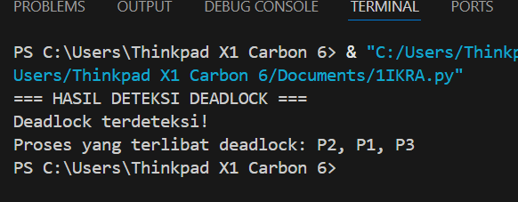

# Laporan Praktikum Minggu 11
Topik: deadlock-detection

---

## Identitas
- **Nama**  : Akhmad Raffi Sarmadan 
- **NIM**   : 250202974
- **Kelas** : 1IKRA

---

## Tujuan
Tuliskan tujuan praktikum minggu ini.  
Contoh:  
> Mahasiswa mampu menjelaskan fungsi utama sistem operasi dan peran kernel serta system call.

---

## Dasar Teori
Tuliskan ringkasan teori (3–5 poin) yang mendasari percobaan.

---

## Langkah Praktikum
1. **Menyiapkan Dataset**

   Gunakan dataset sederhana yang berisi:
   - Daftar proses  
   - Resource Allocation  
   - Resource Request / Need

   Contoh tabel:

   | Proses | Allocation | Request |
   |:--:|:--:|:--:|
   | P1 | R1 | R2 |
   | P2 | R2 | R3 |
   | P3 | R3 | R1 |

2. **Implementasi Algoritma Deteksi Deadlock**

   Program minimal harus:
   - Membaca data proses dan resource.  
   - Menentukan apakah sistem berada dalam kondisi deadlock.  
   - Menampilkan proses mana saja yang terlibat deadlock.

3. **Eksekusi & Validasi**

   - Jalankan program dengan dataset uji.  
   - Validasi hasil deteksi dengan analisis manual/logis.  
   - Simpan hasil eksekusi dalam bentuk screenshot.

4. **Analisis Hasil**
- Sajikan hasil deteksi dalam tabel (proses deadlock / tidak).
-  Jelaskan mengapa deadlock terjadi atau tidak terjadi.
- Kaitkan hasil dengan teori deadlock (empat kondisi).

   

6. **Commit & Push**

   ```bash
   git add .
   git commit -m "Minggu 11 - Deadlock Detection"
   git push origin main
   ```


---

## Kode / Perintah
Tuliskan potongan kode atau perintah utama:
```bash
# Dataset proses
processes = {
    "P1": {"allocation": "R1", "request": "R2"},
    "P2": {"allocation": "R2", "request": "R3"},
    "P3": {"allocation": "R3", "request": "R1"},
}

# Membuat mapping resource ke proses yang memegangnya
resource_owner = {}
for p, data in processes.items():
    resource_owner[data["allocation"]] = p

# Membangun graf ketergantungan antar proses
graph = {}
for p, data in processes.items():
    requested_resource = data["request"]
    if requested_resource in resource_owner:
        graph[p] = resource_owner[requested_resource]
    else:
        graph[p] = None

# Fungsi deteksi siklus (deadlock)
def detect_deadlock(graph):
    visited = set()
    stack = set()
    deadlock_processes = set()

    def dfs(process):
        if process in stack:
            deadlock_processes.add(process)
            return True
        if process in visited or graph[process] is None:
            return False

        visited.add(process)
        stack.add(process)

        next_process = graph[process]
        if dfs(next_process):
            deadlock_processes.add(process)
            return True

        stack.remove(process)
        return False

    for p in graph:
        if dfs(p):
            pass

    return deadlock_processes

# Menjalankan deteksi deadlock
deadlock = detect_deadlock(graph)

# Output hasil
print("=== HASIL DETEKSI DEADLOCK ===")
if deadlock:
    print("Deadlock terdeteksi!")
    print("Proses yang terlibat deadlock:", ", ".join(deadlock))
else:
    print("Tidak terjadi deadlock.")

```

---

## Hasil Eksekusi


---

## Analisis
| Proses | Resource Allocation | Resource Request |    Status    |
| :----: | :-----------------: | :--------------: | :----------: |
|   P1   |          R1         |        R2        | **Deadlock** |
|   P2   |          R2         |        R3        | **Deadlock** |
|   P3   |          R3         |        R1        | **Deadlock** |


- Percobaan membuktikan bahwa deadlock terjadi ketika empat kondisi Coffman terpenuhi

- Kernel dan system call berperan besar dalam terjadinya deadlock

- Perbedaan OS memengaruhi cara deadlock ditangani, bukan cara deadlock terjadi

- Linux dan Windows memiliki kebijakan manajemen resource yang berbeda, sehingga hasil observasi deadlock juga berbeda

---

## Kesimpulan
Percobaan menunjukkan bahwa sistem mengalami deadlock akibat adanya siklus ketergantungan resource antar proses yang saling menunggu.

Deadlock terjadi karena empat kondisi Coffman (mutual exclusion, hold and wait, no preemption, dan circular wait) terpenuhi secara bersamaan.

Kernel dan mekanisme system call berperan penting dalam pengelolaan resource, namun tanpa kebijakan pencegahan atau deteksi, kernel dapat membiarkan deadlock terjadi.

Perbedaan sistem operasi memengaruhi penanganan deadlock, di mana Linux cenderung membiarkan deadlock bertahan, sedangkan Windows lebih aktif melakukan intervensi.


---

## Quiz
1. Apa perbedaan antara deadlock prevention, avoidance, dan detection?

Deadlock prevention bertujuan mencegah deadlock sejak awal dengan menghilangkan salah satu dari empat kondisi deadlock, misalnya dengan membatasi penggunaan resource. Deadlock avoidance berusaha menghindari deadlock dengan memeriksa keadaan sistem sebelum mengalokasikan resource, seperti pada algoritma Banker. Sementara itu, deadlock detection mengizinkan deadlock terjadi, tetapi sistem secara berkala melakukan pemeriksaan untuk mendeteksi deadlock dan kemudian melakukan pemulihan.

2. Mengapa deteksi deadlock tetap diperlukan dalam sistem operasi?

Deteksi deadlock tetap diperlukan karena tidak semua sistem dapat menerapkan prevention atau avoidance secara efisien. Pada sistem dengan banyak proses dan resource yang dinamis, lebih realistis untuk mengizinkan deadlock terjadi dan kemudian mendeteksinya daripada membatasi penggunaan resource secara ketat atau melakukan pemeriksaan kompleks sebelum setiap alokasi.

3. Apa kelebihan dan kekurangan pendekatan deteksi deadlock?

Kelebihan pendekatan deteksi deadlock adalah fleksibilitas yang tinggi karena sistem tidak perlu membatasi alokasi resource sejak awal. Namun, kekurangannya adalah adanya overhead tambahan untuk melakukan proses deteksi serta risiko terganggunya proses ketika sistem harus melakukan pemulihan, seperti menghentikan atau menggulir ulang proses.  

---

## Refleksi Diri
Tuliskan secara singkat:
- Apa bagian yang paling menantang minggu ini?  
- Bagaimana cara Anda mengatasinya?  

---

**Credit:**  
_Template laporan praktikum Sistem Operasi (SO-202501) – Universitas Putra Bangsa_
