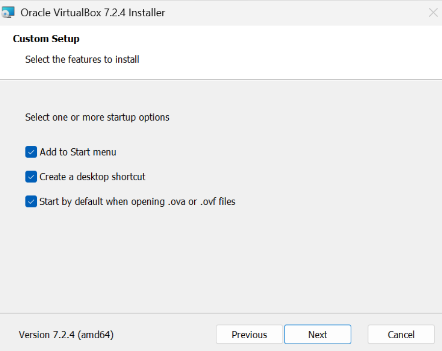
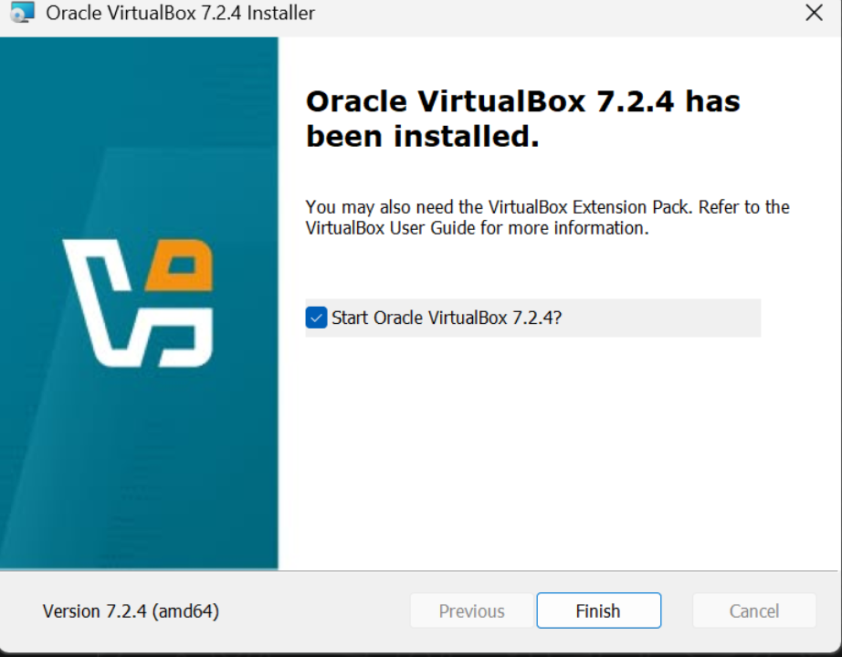
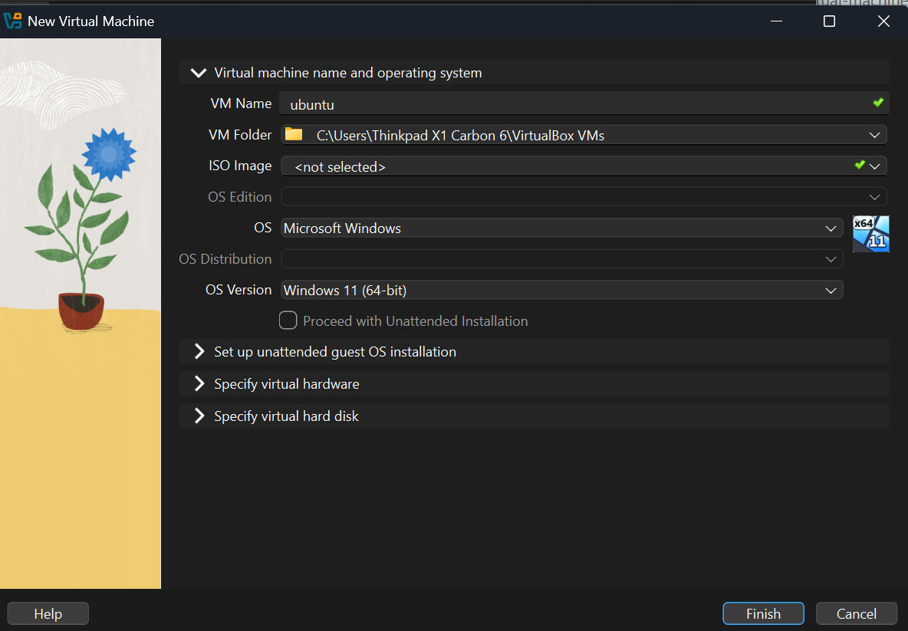
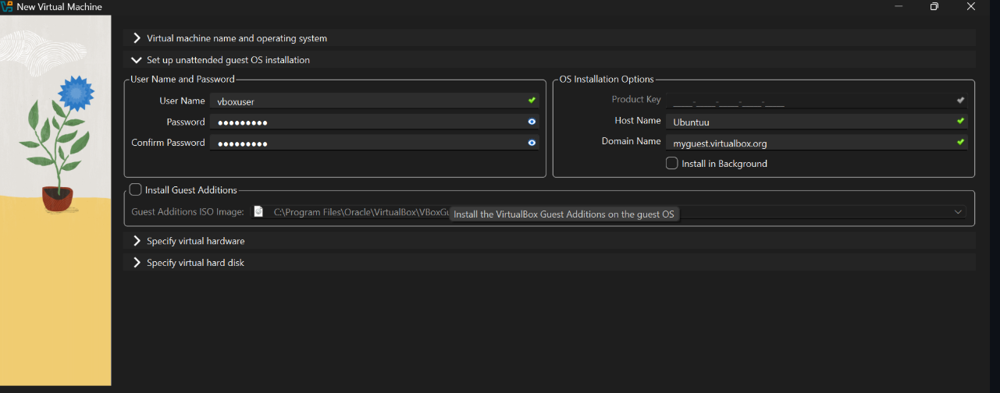
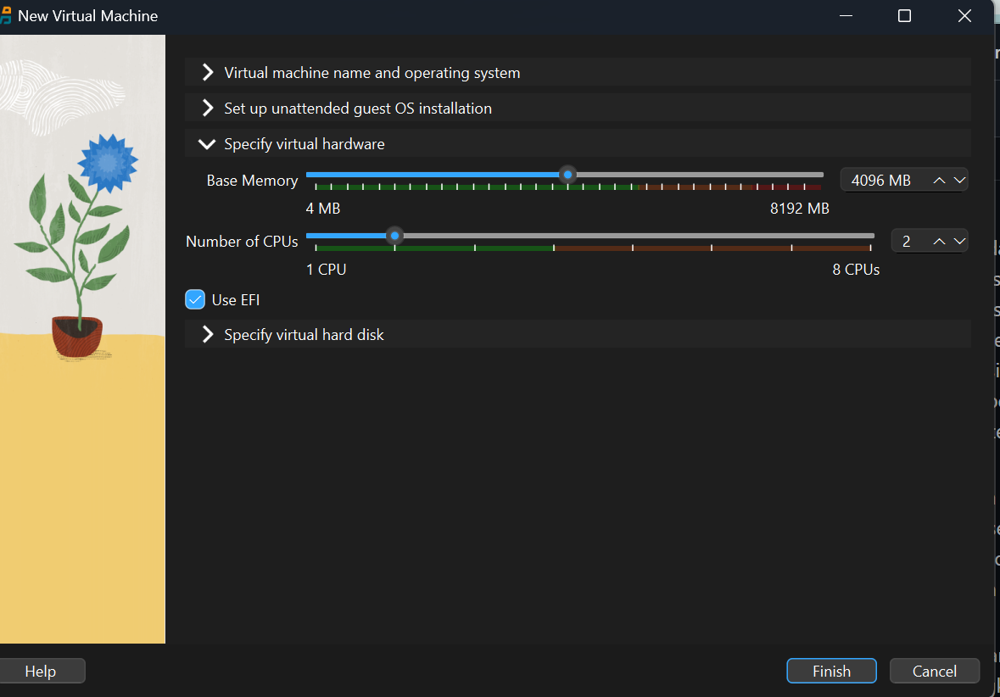
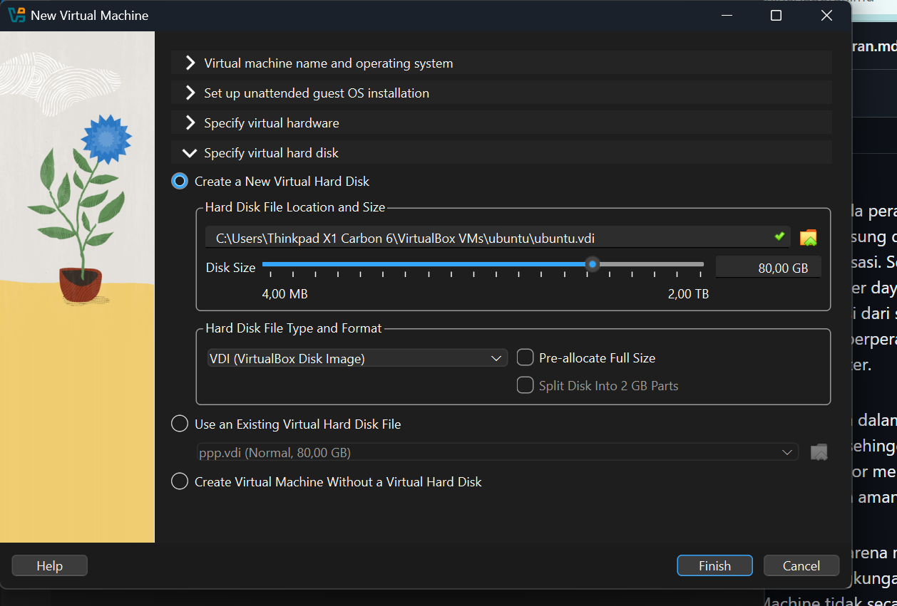
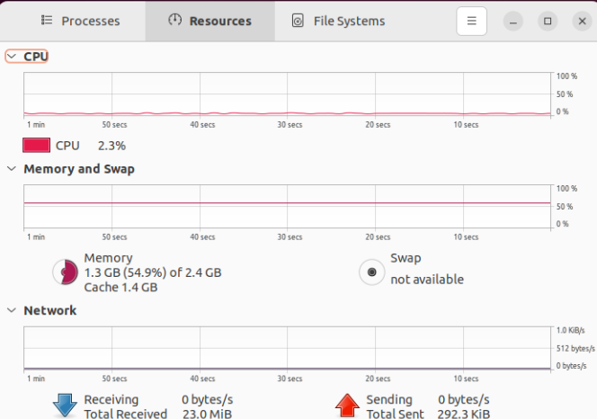

# Laporan Praktikum Minggu [X]
Topik: [Tuliskan judul topik, misalnya "Arsitektur Sistem Operasi dan Kernel"]

---

## Identitas
- **Nama**  : Akhmad Raffi Sarmadan
- **NIM**   : 250202974
- **Kelas** : 1IKRA

---

## Tujuan
Memahami konsep virtualisasi serta perbedaan antara Host OS dan Guest OS.

Mempelajari proses instalasi dan konfigurasi sistem operasi pada mesin virtual.

Menganalisis pengaruh alokasi resource terhadap performa sistem serta aspek keamanan melalui isolasi virtualisasi.

---

## Dasar Teori
Sistem Operasi (Operating System)
Sistem operasi berfungsi sebagai pengelola sumber daya komputer seperti CPU, memori, dan storage, serta menyediakan layanan bagi aplikasi melalui kernel.

Virtualisasi
Virtualisasi adalah teknik untuk menjalankan beberapa sistem operasi secara bersamaan pada satu hardware fisik dengan bantuan mesin virtual (VM).

Hypervisor
Hypervisor merupakan lapisan perangkat lunak yang mengelola VM, membagi resource hardware, dan menjamin isolasi antara Host OS dan Guest OS.

Kernel dan System Call
Kernel adalah inti OS yang mengatur akses ke hardware. System call digunakan aplikasi untuk berinteraksi dengan kernel, yang pada VM diteruskan melalui hypervisor.

Isolasi dan Keamanan Sistem
Virtualisasi menyediakan isolasi antar sistem sehingga kesalahan atau serangan pada satu VM tidak memengaruhi sistem lain maupun host.

---

## Langkah Praktikum
1. **Instalasi Virtual Machine**
   - Instal VirtualBox atau VMware pada komputer host.  
   - Pastikan fitur virtualisasi (VT-x / AMD-V) aktif di BIOS.

2. **Pembuatan OS Guest**
   - Buat VM baru dan pilih OS guest (misal: Ubuntu Linux).  
   - Atur resource awal:
     - CPU: 1–2 core  
     - RAM: 2–4 GB  
     - Storage: ≥ 20 GB

3. **Instalasi Sistem Operasi**
   - Jalankan proses instalasi OS guest sampai selesai.  
   - Pastikan OS guest dapat login dan berjalan normal.

4. **Konfigurasi Resource**
   - Ubah konfigurasi CPU dan RAM.  
   - Amati perbedaan performa sebelum dan sesudah perubahan resource.

5. **Analisis Proteksi OS**
   - Jelaskan bagaimana VM menyediakan isolasi antara host dan guest.  
   - Kaitkan dengan konsep *sandboxing* dan *hardening* OS.

6. **Dokumentasi**
   - Ambil screenshot setiap tahap penting.  
   - Simpan di folder `screenshots/`.

7. **Commit & Push**
   ```bash
   git add .
   git commit -m "Minggu 12 - Virtual Machine"
   git push origin main
   ```


---

## Kode / Perintah
Tuliskan potongan kode atau perintah utama:
```bash
uname -a
lsmod | head
dmesg | head
```

---

## Hasil Eksekusi




















---

## Analisis
1. Makna Hasil Percobaan

Hasil percobaan menunjukkan bahwa sistem operasi guest dapat berjalan normal di atas host melalui virtual machine. Perubahan alokasi CPU dan RAM berpengaruh langsung terhadap performa guest OS, menandakan bahwa pengelolaan resource dilakukan secara terkontrol oleh sistem virtualisasi tanpa mengganggu host.

2. Keterkaitan dengan Teori OS

Secara teori, kernel host melalui hypervisor bertugas mengelola resource fisik dan menyediakan abstraksi hardware. System call dari guest OS tidak langsung ke hardware, tetapi diteruskan melalui hypervisor. Hal ini sesuai dengan arsitektur OS berlapis, di mana akses hardware dibatasi demi stabilitas dan keamanan.

3. Perbedaan Hasil pada Linux vs Windows

Linux umumnya lebih ringan dan efisien dalam VM, sehingga performa lebih stabil dengan resource kecil.

Windows membutuhkan resource lebih besar dan memiliki overhead lebih tinggi.
Perbedaan ini disebabkan oleh desain kernel, manajemen memori, dan layanan sistem bawaan masing-masing OS.

---

## Kesimpulan
Virtualisasi memungkinkan menjalankan sistem operasi guest secara aman dan terisolasi di atas satu perangkat keras fisik melalui peran hypervisor.

Alokasi resource (CPU dan RAM) berpengaruh langsung terhadap performa OS guest, sehingga perlu disesuaikan dengan kebutuhan dan kapasitas host.

Perbedaan arsitektur dan manajemen kernel menyebabkan performa virtual machine pada Linux umumnya lebih efisien dibandingkan Windows.

---

## Quiz
1. Perbedaan Host OS dan Guest OS?

Host OS: Sistem operasi utama yang berjalan langsung di hardware.

Guest OS: Sistem operasi yang berjalan di dalam mesin virtual.

2. Peran Hypervisor?

Hypervisor berfungsi mengelola mesin virtual, membagi sumber daya hardware, dan menghubungkan Guest OS dengan hardware.

3. Alasan Virtualisasi Meningkatkan Keamanan?

Karena adanya isolasi, gangguan atau serangan pada satu VM tidak memengaruhi sistem lain atau Host OS.

---

## Refleksi Diri
Tuliskan secara singkat:
- Apa bagian yang paling menantang minggu ini?  
- Bagaimana cara Anda mengatasinya?  

---

**Credit:**  
_Template laporan praktikum Sistem Operasi (SO-202501) – Universitas Putra Bangsa_
