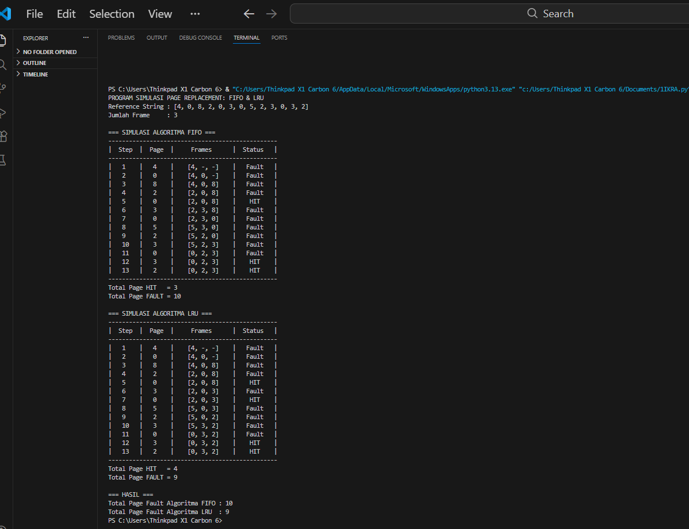

# Laporan Praktikum Minggu [X]
Topik: [Tuliskan judul topik, misalnya "Arsitektur Sistem Operasi dan Kernel"]

---

## Identitas
- **Nama**  : Akhmad Raffi Sarmadan  
- **NIM**   : 250202974
- **Kelas** : 1IKRA

---

## Tujuan
Mensimulasikan proses page replacement pada sistem operasi menggunakan algoritma FIFO dan LRU.

Membandingkan kinerja kedua algoritma berdasarkan jumlah page hit dan page fault.

Membantu memahami cara kerja manajemen memori dalam sistem operasi serta dampak pemilihan algoritma terhadap efisiensi penggunaan frame.

---

## Dasar Teori
Manajemen Memori (Memory Management)
Manajemen memori adalah fungsi kernel sistem operasi untuk mengatur penggunaan memori utama (RAM), termasuk alokasi, dealokasi, dan pemindahan data antara memori dan storage.

Paging dan Page Replacement
Paging membagi memori menjadi unit tetap yang disebut page dan frame. Jika page yang dibutuhkan tidak ada di memori, terjadi page fault, sehingga diperlukan algoritma page replacement.

Algoritma FIFO (First In First Out)
FIFO mengganti page yang pertama kali masuk ke memori tanpa mempertimbangkan frekuensi atau waktu penggunaan terakhir, sehingga dapat menyebabkan page fault lebih banyak.

Algoritma LRU (Least Recently Used)
LRU mengganti page yang paling lama tidak digunakan, sehingga lebih mendekati perilaku optimal dan umumnya menghasilkan page fault lebih sedikit dibanding FIFO.

---

## Langkah Praktikum
1. **Menentukan Topik Laporan**

   Pilih 1 topik dari praktikum sebelumnya (mis. Minggu 9/10/11/13) dan tetapkan tujuan eksperimen yang ingin disampaikan.

2. **Menyiapkan Bahan**

   - Kode/program yang digunakan.
   - Dataset/parameter uji (jika ada).
   - Bukti hasil eksekusi (screenshot) dan/atau grafik.

3. **Menulis Laporan dengan Struktur IMRAD**

   Tulis `praktikum/week14-laporan-imrad/laporan.md` dengan struktur minimal berikut:
   - **Pendahuluan (Introduction):** latar belakang, rumusan masalah/tujuan.
   - **Metode (Methods):** lingkungan uji, langkah eksperimen, parameter/dataset, cara pengukuran.
   - **Hasil (Results):** tabel/grafik hasil uji, ringkasan temuan.
   - **Pembahasan (Discussion):** interpretasi hasil, keterbatasan, perbandingan teori/ekspektasi.
   - **Kesimpulan:** 2–4 poin ringkas menjawab tujuan.

4. **Menyajikan Tabel/Grafik**

   - Tabel harus diberi judul/keterangan singkat.
   - Jika menggunakan grafik: jelaskan sumbu dan arti grafik.

5. **Sitasi dan Daftar Pustaka**

   - Cantumkan referensi minimal 2 sumber.
   - Gunakan format konsisten (mis. daftar bernomor).

6. **Commit & Push Draft**

   ```bash
   git add .
   git commit -m "Minggu 14 - Draft Laporan IMRAD"
   git push origin main
   ```

---

## Kode / Perintah
Tuliskan potongan kode atau perintah utama:
```bash
pages = [4, 0, 8, 2, 0, 3, 0, 5, 2, 3, 0, 3, 2]

frame_size = 3


def print_table(rows, title):
    line = "-" * 49 
    print("\n" + title)
    print(line)
    print(f"| {'Step':^6} | {'Page':^6} | {'Frames':^15} | {'Status':^9} |")
    print(line)
    for r in rows:
        # gabungkan frame jadi format [a, b, c]
        frames_str = f"[{r['f1']}, {r['f2']}, {r['f3']}]"
        print(f"| {r['step']:^6} | {r['page']:^6} | {frames_str:^15} | {r['status']:^9} |")
    print(line)


def fifo(pages, frame_size):
    frames = []         
    index_fifo = 0     
    faults = 0         
    hits = 0           
    rows = []          

    for step, page in enumerate(pages, start=1):

        if page in frames:
            status = "HIT"
            hits += 1

        else:
            status = "Fault"
            faults += 1

            if len(frames) < frame_size:
                frames.append(page)

            else:
                frames[index_fifo] = page
                index_fifo = (index_fifo + 1) % frame_size  

        show = frames + ["-"] * (frame_size - len(frames))

        rows.append({
            "step": step,
            "page": page,
            "f1": show[0],
            "f2": show[1],
            "f3": show[2],
            "status": status
        })

    print_table(rows, "=== SIMULASI ALGORITMA FIFO ===")
    print(f"Total Page HIT   = {hits}")
    print(f"Total Page FAULT = {faults}")
    return faults


def lru(pages, frame_size):
    frames = []         
    last_used = {}      
    faults = 0
    hits = 0
    rows = []

    for step, page in enumerate(pages, start=1):

        if page in frames:
            status = "HIT"
            hits += 1

        else:
            status = "Fault"
            faults += 1

           
            if len(frames) < frame_size:
                frames.append(page)

            
            else:
                lru_page = min(last_used, key=last_used.get)  
                frames[frames.index(lru_page)] = page         
                del last_used[lru_page]                       

        last_used[page] = step

        show = frames + ["-"] * (frame_size - len(frames))

        rows.append({
            "step": step,
            "page": page,
            "f1": show[0],
            "f2": show[1],
            "f3": show[2],
            "status": status
        })

    print_table(rows, "=== SIMULASI ALGORITMA LRU ===")
    print(f"Total Page HIT   = {hits}")
    print(f"Total Page FAULT = {faults}")
    return faults

print("PROGRAM SIMULASI PAGE REPLACEMENT: FIFO & LRU")
print("Reference String :", pages)
print("Jumlah Frame     :", frame_size)

fifo_faults = fifo(pages, frame_size)

lru_faults = lru(pages, frame_size)

print("\n=== HASIL ===")
print(f"Total Page Fault Algoritma FIFO : {fifo_faults}")
print(f"Total Page Fault Algoritma LRU  : {lru_faults}")
```

---

## Hasil Eksekusi


---

## Analisis
1. Pendahuluan (Introduction)

Praktikum ini dilakukan untuk memahami mekanisme manajemen memori pada sistem operasi, khususnya algoritma page replacement FIFO dan LRU. Rumusan masalah pada praktikum ini adalah bagaimana perbedaan kinerja kedua algoritma dalam menangani page fault. Tujuan praktikum adalah membandingkan efisiensi FIFO dan LRU berdasarkan hasil simulasi. 

2.Metode (Methods)

Pengujian dilakukan menggunakan program simulasi berbasis Python pada sistem operasi Windows. Parameter yang digunakan meliputi reference string dan jumlah frame tertentu. Eksperimen dilakukan dengan menjalankan simulasi FIFO dan LRU secara terpisah, kemudian mencatat jumlah page hit dan page fault sebagai indikator kinerja.

3. Hasil (Results)

   -> **Tabel Simulasi FIFO**       
Menunjukkan urutan penggantian halaman berdasarkan FIFO. Kolom “Frames” memperlihatkan isi memori setiap langkah, dan “Status” menunjukkan page fault atau hit. Tabel ini berisi ringkasan simulasi algoritma FIFO, memperlihatkan bagaimana halaman dimuat dan diganti di memori serta mencatat status page hit atau page fault pada setiap langkah.

| Step | Page |   Frames  | Status |
| :--: | :--: | :-------: | :----: |
|   1  |   4  | [4, –, –] |  Fault |
|   2  |   0  | [4, 0, –] |  Fault |
|   3  |   8  | [4, 0, 8] |  Fault |
|   4  |   2  | [2, 0, 8] |  Fault |
|   5  |   0  | [2, 0, 8] |   Hit  |
|   6  |   3  | [2, 3, 8] |  Fault |
|   7  |   0  | [2, 3, 0] |  Fault |
|   8  |   5  | [5, 3, 0] |  Fault |
|   9  |   2  | [5, 2, 0] |  Fault |
|  10  |   3  | [5, 2, 3] |  Fault |
|  11  |   0  | [0, 2, 3] |  Fault |
|  12  |   3  | [0, 2, 3] |   Hit  |
|  13  |   2  | [0, 2, 3] |   Hit  |

-> **Tabel Simulasi LRU**    
Menunjukkan penggantian halaman berdasarkan algoritma LRU. Halaman yang paling lama tidak digunakan diganti. Tabel ini berisi simulasi algoritma LRU, menggambarkan penggantian halaman yang paling lama tidak digunakan dan mencatat page hit atau page fault secara berurutan.


| Step | Page |   Frames  | Status |
| :--: | :--: | :-------: | :----: |
|   1  |   4  | [4, –, –] |  Fault |
|   2  |   0  | [4, 0, –] |  Fault |
|   3  |   8  | [4, 0, 8] |  Fault |
|   4  |   2  | [2, 0, 8] |  Fault |
|   5  |   0  | [2, 0, 8] |   Hit  |
|   6  |   3  | [2, 0, 3] |  Fault |
|   7  |   0  | [2, 0, 3] |   Hit  |
|   8  |   5  | [5, 0, 3] |  Fault |
|   9  |   2  | [5, 0, 2] |  Fault |
|  10  |   3  | [5, 3, 2] |  Fault |
|  11  |   0  | [0, 3, 2] |  Fault |
|  12  |   3  | [0, 3, 2] |   Hit  |
|  13  |   2  | [0, 3, 2] |   Hit  |

-> **Tabel Total Page Fault dan Page Hit**  
Menampilkan rekap jumlah page hit dan page fault dari kedua algoritma. Tabel ini merangkum jumlah page hit dan page fault dari kedua algoritma.

| Algoritma | Jumlah Akses Halaman | Page Hit | Page Fault |
| :-------- | :------------------: | :------: | :--------: |
| FIFO      |          13          |     3    |     10     |
| LRU       |          13          |     4    |      9     |

---

## Kesimpulan
Algoritma LRU menghasilkan jumlah page fault lebih sedikit dibandingkan FIFO, sehingga lebih efisien dalam pengelolaan memori.

Jumlah frame dan pola reference string sangat memengaruhi kinerja algoritma page replacement.

Pemilihan algoritma page replacement yang tepat dapat meningkatkan performa sistem operasi secara keseluruhan.

---

## Quiz
1. Mengapa format IMRAD membantu laporan lebih ilmiah?

Format IMRAD (Introduction, Methods, Results, and Discussion) membuat laporan tersusun sistematis, logis, dan mudah ditelusuri, sehingga memudahkan pembaca dan dosen dalam mengevaluasi tujuan, metode, serta validitas hasil praktikum.

2. Perbedaan bagian Hasil dan Pembahasan?

Hasil: Menyajikan data atau output percobaan apa adanya (tabel, grafik, hasil program).

Pembahasan: Menjelaskan, menganalisis, dan mengaitkan hasil dengan teori atau tujuan praktikum.

3. Pentingnya sitasi dan daftar pustaka?

Sitasi dan daftar pustaka menunjukkan dasar teori yang digunakan, menghindari plagiarisme, serta meningkatkan kredibilitas dan keilmiahan laporan, meskipun dalam laporan praktikum.

---

## Refleksi Diri
Tuliskan secara singkat:
- Apa bagian yang paling menantang minggu ini?  
- Bagaimana cara Anda mengatasinya?  

---

## referensi

1. Silberschatz, A., Galvin, P. B., & Gagne, G. (2018). *Operating system concepts* (10th ed.). Hoboken, NJ, USA: John Wiley & Sons.
2. Tanenbaum, A. S., & Bos, H. (2015). *Modern operating systems* (4th ed.). Boston, MA, USA: Pearson Education.
3. OSTEP, Virtual Memory & Page Replacement


**Credit:**  
_Template laporan praktikum Sistem Operasi (SO-202501) – Universitas Putra Bangsa_
