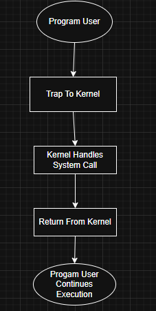

# Laporan Praktikum Minggu 2
Topik: syscall structures

---

## Identitas
- **Nama**  : Akhmad Raffi Sarmadan
- **NIM**   : 250202974
- **Kelas** : 1IKRA

---

## Tujuan
Tuliskan tujuan praktikum minggu ini.  
Mampu untuk menjalankan praktikum dengan benar terutama pada aplikasi ubuntu.

---

## Dasar Teori
1. Pengelolaan Proses dan Sumber Daya Ubuntu memungkinkan pengguna untuk memahami konsep sistem operasi melalui pengamatan dan manipulasi proses: -Menggunakan perintah seperti ps, top, kill, dan nice untuk mengelola proses.
-Praktikum sering kali melibatkan pengamatan CPU usage, memory usage, serta interaksi antar proses (IPC).
2. Ubuntu sebagai Sistem Operasi Open Source Ubuntu adalah distribusi Linux berbasis Debian yang bersifat open source dan banyak digunakan dalam lingkungan akademik dan industri. Keunggulannya mencakup:
-Gratis dan legal untuk digunakan dan dimodifikasi.
-Memiliki dukungan komunitas yang luas.
-Menyediakan lingkungan terminal dan GUI (Graphical User Interface) yang cocok untuk percobaan praktikum sistem operasi maupun jaringan.
3. Lingkungan Terminal sebagai Sarana Eksperimen Terminal di Ubuntu memungkinkan pengguna melakukan berbagai tugas melalui perintah-perintah shell (bash). Ini menjadi sarana utama dalam praktikum karena:
-Memungkinkan akses langsung ke sistem operasi.
-Cocok untuk menjalankan script Shell, Python, dan berbagai utilitas sistem.
-Digunakan untuk mengeksplorasi manajemen proses, file, dan jaringan.
---

## Langkah Praktikum
1. Langkah-langkah yang dilakukan.  
2. Perintah yang dijalankan : :strace ls, screenshot/syscall_ls.png., screenshot/syscall-diagram.png. 
3. File dan kode yang dibuat : laporan.md.
4. Commit message yang digunakan : gitt add ., gitt commit -m "Minggu 2 - Struktur, gitt push origin main


---

## Kode / Perintah
Tuliskan potongan kode atau perintah utama:
```bash
strace ls
strace -e trace=open,read,write,close cat /etc/passwd
dmesg | tail -n 10
```

---

## Hasil Eksekusi
Sertakan screenshot hasil percobaan atau diagram:




---

## Analisis
- Jelaskan makna hasil percobaan.

  1.Proses yang diamati melalui strace berfokus pada interaksi antara aplikasi dan kernel, terutama terkait pemanggilan system call seperti openat, read, mmap, dan brk. Analisis ini penting karena menggambarkan bagaimana aplikasi berkomunikasi dengan sumber daya OS (file, memori, perangkat) pada tingkat rendah.

2.Fokus pada hubungan antara hasil percobaan dengan teori kernel, khususnya bagaimana fungsi-fungsi kernel bekerja sebagai interface antara program pengguna dan sumber daya sistem. Pemahaman ini mencakup bagaimana sistem call memetakan permintaan aplikasi ke tindakan konkret di kernel (contohnya membaca file, mengalokasikan memori, atau memetakan alamat memori).

3.Perbandingan lingkungan OS (Linux vs Windows) disebutkan sebagai bagian analisis untuk memahami perbedaan arsitektur dan implementasi IPC, manajemen memori, serta antarmuka sistem call antara kedua sistem operasi. Analisis ini membantu menilai portabilitas dan batasan praktikum saat beralih antara platform.

4.Catatan tentang beberapa konfigurasi tidak ditemukan (misalnya beberapa file konfigurasi seperti SELinux config yang tidak ada) menunjukkan bahwa hasil percobaan bisa dipengaruhi oleh ketersediaan sumber daya lingkungan eksekusi. Hal ini menunjukkan pentingnya penanganan error dan fallback dalam konteks praktikum.

- Hubungkan hasil dengan teori (fungsi kernel, system call, arsitektur OS).

  1.Sistem call seperti openat, read, mmap, dan brk menggambarkan pola umum pemanggilan kernel: nama function call menunjukkan jenis operasi, sedangkan argumen memberikan konteks operasi (path, flags, ukuran buffer, alamat memori). Return value menunjukkan sukses atau gagal, dengan kode error POSIX yang relevan. Analisis ini selaras dengan konsep antarmuka kernel yang mengabstraksi akses ke file, memori, dan perangkat.

2.Jika terjadi kegagalan karena file tidak ditemukan (ENOENT) atau akses ditolak (EACCES), analisis perlu menyoroti bagaimana aplikasi menambah mekanisme fallback atau penanganan kesalahan agar program tetap robust meskipun konfigurasi tidak lengkap.

- Apa perbedaan hasil di lingkungan OS berbeda (Linux vs Windows)?  

1.Linux dan Windows memiliki arsitektur kernel yang berbeda serta set sistem call yang spesifik pada masing-masing OS. Analisis ini membantu menjelaskan perbedaan perilaku saat menjalankan percobaan yang sama pada kedua lingkungan, misalnya dalam hal pemetaan memori, manajemen file, dan model keamanan (SELinux di Linux vs model keamanan Windows).

---

## Tabel Observasi
| No. | Elemen Struktur               | Contoh dari `strace`                                    | Penjelasan                                                           |
| --- | ----------------------------- | ------------------------------------------------------- | -------------------------------------------------------------------- |
| 1   | **Nama System Call**          | `openat`, `read`, `fstat`, `mmap`, `ioctl`, `brk`       | Nama fungsi sistem yang dipanggil oleh aplikasi                      |
| 2   | **Argumen/Parameter**         | `openat(AT_FDCWD, "/path", O_RDONLY)`                   | Parameter yang dikirim ke kernel (path, flags, ukuran, pointer, dll) |
| 3   | **File Descriptor (fd)**      | `fd = 3`, `fd = 0`                                      | Angka yang merepresentasikan file/resource yang dibuka               |
| 4   | **Return Value**              | `= 3`, `= -1 ENOENT`, `= 2996`                          | Hasil dari system call: bisa sukses (nilai), atau gagal (kode error) |
| 5   | **Error Code (jika gagal)**   | `ENOENT`, `ENOTTY`, `EACCES`                            | Kode error standar POSIX, muncul jika system call gagal              |
| 6   | **Komentar Tambahan**         | `No such file or directory`, `Inappropriate ioctl`      | Penjelasan tambahan tentang error (biasanya dalam kurung)            |
| 7   | **Aksi Kernel**               | Mapping memory, membaca file, memproteksi halaman, dsb  | Apa yang dilakukan oleh kernel saat system call dijalankan           |
| 8   | **Waktu Eksekusi (opsional)** | Tidak muncul di screenshot, tapi bisa `usec` atau `sec` | Digunakan jika `strace -T` atau `-tt` untuk melihat lama eksekusi    |

## Kesimpulan
1.System Call adalah Antarmuka Utama antara Aplikasi dan Kernel:
Semua interaksi aplikasi dengan resource sistem seperti file, memori, dan perangkat keras dilakukan melalui system call.
Contoh system call yang diamati: openat, read, fstat, mmap, ioctl, brk.

2.Beberapa File Konfigurasi Tidak Ditemukan:
System call seperti openat("/etc/selinux/config") gagal karena file tidak ada (ENOENT), tapi proses tetap berjalan.

3.truktur System Call Mengikuti Pola yang Konsisten:Nama fungsi → menjelaskan jenis operasi (misal: read untuk membaca file).
Parameter → nilai/nama file, flags, ukuran buffer, dll.

---

## Quiz
1. Apa fungsi utama system call dalam sistem operasi?
   Jawaban: -Mengakses file dan perangkat keras.
-Mengelola memori.
-Mengatur proses.
-Berkomunikasi antar proses (IPC).
2. Sebutkan 4 kategori system call yang umum digunakan. 
   Jawaban: -Manajemen Proses (Process Control):
Untuk membuat, mengakhiri, atau memodifikasi proses.
Contoh: fork(), exec(), exit(), wait().
-Manajemen File (File Management):
Untuk membuka, membaca, menulis, atau menghapus file.
Contoh: open(), read(), write(), close().
-Manajemen Sistem I/O (Device Management):
Untuk mengakses dan mengatur perangkat input/output.
Contoh: ioctl(), read(), write().
-Manajemen Memori (Memory Management):
Untuk mengalokasikan atau membebaskan memori.
Contoh: brk(), mmap().
3. Mengapa system call tidak bisa dipanggil langsung oleh user program?
   Jawaban: Karena program pengguna berjalan di user mode yang terbatas, sedangkan system call membutuhkan akses kernel mode untuk alasan keamanan, proteksi, dan stabilitas sistem.

---

## Refleksi Diri
Tuliskan secara singkat:
- Apa bagian yang paling menantang minggu ini?
  melakukan percobaan pada aplikasi ubuntu terutama pada saat coding.
- Bagaimana cara Anda mengatasinya?  
  melihat ulang perintah di docs jika kurang paham tanya kepada teman yang sudah bisa.
---

**Credit:**  
_Template laporan praktikum Sistem Operasi (SO-202501) – Universitas Putra Bangsa_
