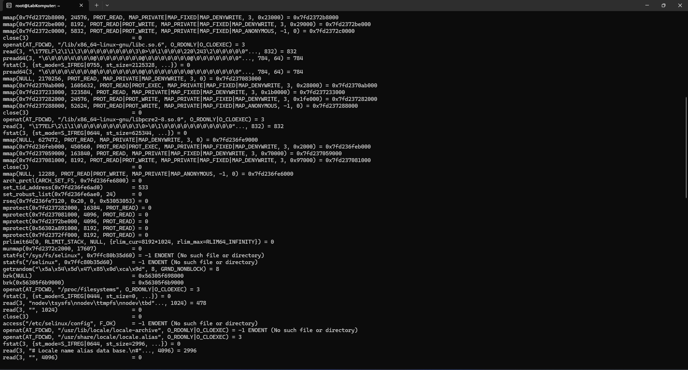
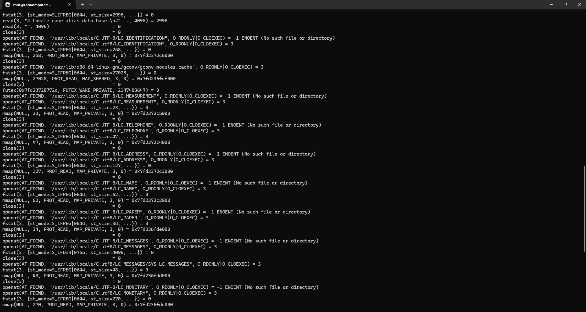
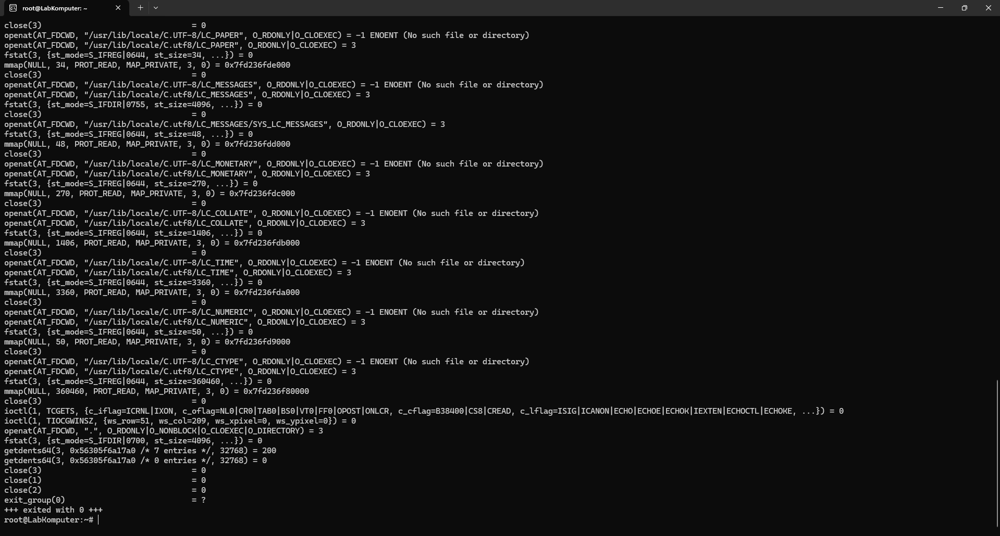

# Laporan Praktikum Minggu 2
Topik: syscall structures

---

## Identitas
- **Nama**  : Akhmad Raffi Sarmadan
- **NIM**   : 250202974
- **Kelas** : 1IKRA

---

## Tujuan
Tuliskan tujuan praktikum minggu ini.  
Mampu untuk menjalankan praktikum dengan benar terutama pada aplikasi ubuntu.

---

## Dasar Teori
1. Pengelolaan Proses dan Sumber Daya Ubuntu memungkinkan pengguna untuk memahami konsep sistem operasi melalui pengamatan dan manipulasi proses: -Menggunakan perintah seperti ps, top, kill, dan nice untuk mengelola proses.
-Praktikum sering kali melibatkan pengamatan CPU usage, memory usage, serta interaksi antar proses (IPC).
2. Ubuntu sebagai Sistem Operasi Open Source Ubuntu adalah distribusi Linux berbasis Debian yang bersifat open source dan banyak digunakan dalam lingkungan akademik dan industri. Keunggulannya mencakup:
-Gratis dan legal untuk digunakan dan dimodifikasi.
-Memiliki dukungan komunitas yang luas.
-Menyediakan lingkungan terminal dan GUI (Graphical User Interface) yang cocok untuk percobaan praktikum sistem operasi maupun jaringan.
3. Lingkungan Terminal sebagai Sarana Eksperimen Terminal di Ubuntu memungkinkan pengguna melakukan berbagai tugas melalui perintah-perintah shell (bash). Ini menjadi sarana utama dalam praktikum karena:
-Memungkinkan akses langsung ke sistem operasi.
-Cocok untuk menjalankan script Shell, Python, dan berbagai utilitas sistem.
-Digunakan untuk mengeksplorasi manajemen proses, file, dan jaringan.
---

## Langkah Praktikum
1. Langkah-langkah yang dilakukan.  
2. Perintah yang dijalankan : :strace ls, screenshot/syscall_ls.png., screenshot/syscall-diagram.png. 
3. File dan kode yang dibuat : laporan.md.
4. Commit message yang digunakan : gitt add ., gitt commit -m "Minggu 2 - Struktur, gitt push origin main


---

## Kode / Perintah
Tuliskan potongan kode atau perintah utama:
```bash
strace ls
strace -e trace=open,read,write,close cat /etc/passwd
dmesg | tail -n 10
```

---

## Hasil Eksekusi
Sertakan screenshot hasil percobaan atau diagram:



---

## Analisis
- Jelaskan makna hasil percobaan.  
- Hubungkan hasil dengan teori (fungsi kernel, system call, arsitektur OS).  
- Apa perbedaan hasil di lingkungan OS berbeda (Linux vs Windows)?  

---

## Kesimpulan
Tuliskan 2–3 poin kesimpulan dari praktikum ini.

---

## Quiz
1. Apa fungsi utama system call dalam sistem operasi?
   Jawaban: -Mengakses file dan perangkat keras.
-Mengelola memori.
-Mengatur proses.
-Berkomunikasi antar proses (IPC).
2. Sebutkan 4 kategori system call yang umum digunakan. 
   Jawaban: -Manajemen Proses (Process Control):
Untuk membuat, mengakhiri, atau memodifikasi proses.
Contoh: fork(), exec(), exit(), wait().
-Manajemen File (File Management):
Untuk membuka, membaca, menulis, atau menghapus file.
Contoh: open(), read(), write(), close().
-Manajemen Sistem I/O (Device Management):
Untuk mengakses dan mengatur perangkat input/output.
Contoh: ioctl(), read(), write().
-Manajemen Memori (Memory Management):
Untuk mengalokasikan atau membebaskan memori.
Contoh: brk(), mmap().
3. Mengapa system call tidak bisa dipanggil langsung oleh user program?
   Jawaban: Karena program pengguna berjalan di user mode yang terbatas, sedangkan system call membutuhkan akses kernel mode untuk alasan keamanan, proteksi, dan stabilitas sistem.

---

## Refleksi Diri
Tuliskan secara singkat:
- Apa bagian yang paling menantang minggu ini?  
- Bagaimana cara Anda mengatasinya?  

---

**Credit:**  
_Template laporan praktikum Sistem Operasi (SO-202501) – Universitas Putra Bangsa_
