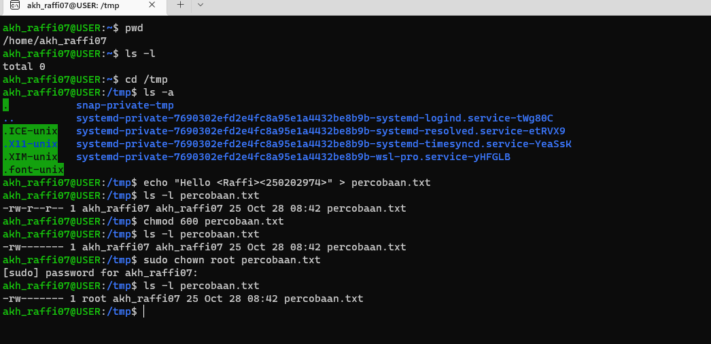

# Laporan Praktikum Minggu 3
Topik: linux-fs-permission

---

## Identitas
- **Nama**  : Akhmad Raffi Sarmadan
- **NIM**   : 250202974 
- **Kelas** :1IKRA
---

## Tujuan
-Mengenal direktori kerja dan sistem file Linux
-Menggunakan perintah dasar seperti pwd, ls, dan cd untuk menavigasi sistem file.
---

## Dasar Teori
1. Abraham Silberschatz, Peter Baer Galvin, Greg Gagne — Operating System Concepts (2018)
Buku ini menjelaskan bahwa sistem operasi mengatur sumber daya komputer, termasuk manajemen file. Setiap file memiliki atribut dan hak akses yang diatur untuk menjaga keamanan data. Mekanisme seperti access control menentukan siapa yang dapat membaca, menulis, atau mengeksekusi file.
➡️ Relevansi: Konsep ini diterapkan saat menggunakan chmod dan chown untuk mengatur izin dan kepemilikan file.
2. Andrew S. Tanenbaum, Herbert Bos — Modern Operating Systems (2015)
Tanenbaum menekankan bahwa file system menyediakan struktur penyimpanan dan kontrol akses melalui permission bits (r, w, x) bagi owner, group, dan others. Hanya pengguna dengan hak superuser (root) yang dapat mengubah kepemilikan file.
➡️ Relevansi: Terlihat saat file diubah menjadi milik root dengan perintah sudo chown root.
3. Linux Manual Pages (man chmod, man chown, man ls)
Manual Linux menjelaskan fungsi perintah:
ls menampilkan atribut file,
chmod mengubah izin akses,
chown mengubah kepemilikan file.
➡️ Relevansi: Menjadi panduan utama penggunaan perintah dalam praktikum.
4. OSTEP — Operating Systems: Three Easy Pieces (2018)
OSTEP membahas sistem operasi sebagai pengelola virtualization, concurrency, dan persistence. Dalam konteks file system, dijelaskan pentingnya proteksi dan keamanan data melalui mekanisme izin dan kepemilikan file.
➡️ Relevansi: Menjelaskan dasar teoretis bagaimana sistem operasi mengatur akses file melalui kernel.
---

## Langkah Praktikum
1. Langkah-langkah yang dilakukan.
   jawab: Setup Environment
Gunakan Linux (Ubuntu/WSL).
Pastikan folder kerja berada di dalam direktori repositori Git praktikum:
praktikum/week3-linux-fs-permission/
Eksperimen 1 – Navigasi Sistem File Jalankan perintah berikut:
pwd
ls -l
cd /tmp
ls -a
Jelaskan hasil tiap perintah.
Catat direktori aktif, isi folder, dan file tersembunyi (jika ada).
Eksperimen 2 – Membaca File Jalankan perintah:
cat /etc/passwd | head -n 5
Jelaskan isi file dan struktur barisnya (user, UID, GID, home, shell).
Eksperimen 3 – Permission & Ownership Buat file baru:
echo "Hello <NAME><NIM>" > percobaan.txt
ls -l percobaan.txt
chmod 600 percobaan.txt
ls -l percobaan.txt
Analisis perbedaan sebelum dan sesudah chmod.
Ubah pemilik file (jika memiliki izin sudo):
sudo chown root percobaan.txt
ls -l percobaan.txt
Catat hasilnya.
Eksperimen 4 – Dokumentasi
Ambil screenshot hasil terminal dan simpan di:
praktikum/week3-linux-fs-permission/screenshots/
Tambahkan analisis hasil pada laporan.md.
Commit & Push
git add .
git commit -m "Minggu 3 - Linux File System & Permission"
git push origin main
 
3. Perintah yang dijalankan.
 jawab: pwd
ls -l
cd /tmp
ls -a
cat /etc/passwd | head -n 5
echo "Hello <NAME><NIM>" > percobaan.txt
ls -l percobaan.txt
chmod 600 percobaan.txt
ls -l percobaan.txt
sudo chown root percobaan.txt
ls -l percobaan.txt 
4. File dan kode yang dibuat.
 jawab: praktikum/week3-linux-fs-permission/screenshots/  
6. Commit message yang digunakan.
 jawab: git add .
git commit -m "Minggu 3 - Linux File System & Permission"
git push origin main
---

## Kode / Perintah
Tuliskan potongan kode atau perintah utama:
```bash
pwd
ls -l
cd /tmp
ls -a
cat /etc/passwd | head -n 5
echo "Hello <NAME><NIM>" > percobaan.txt
ls -l percobaan.txt
chmod 600 percobaan.txt
ls -l percobaan.txt
sudo chown root percobaan.txt
ls -l percobaan.txt
```

---

## Hasil Eksekusi

---

## Analisis
- Jelaskan makna hasil percobaan.
  jawab: File percobaan.txt sekarang dimiliki oleh root, dan hanya root yang memiliki hak akses penuh. User biasa (akh_raffi07) tidak dapat lagi membaca atau mengedit file tersebut tanpa hak superuser (sudo).

- Hubungkan hasil dengan teori (fungsi kernel, system call, arsitektur OS).
  jawab: a. Fungsi Kernel
Kernel bertanggung jawab atas pengelolaan sumber daya sistem, termasuk:
File management: mengatur akses ke file (membaca, menulis, menghapus).
Security & protection: memastikan hanya proses yang berwenang yang bisa mengakses file tertentu.
Pada percobaan ini, setiap perintah seperti chmod dan chown mengirim system call ke kernel (misalnya sys_chmod() dan sys_chown()). Kernel kemudian mengubah metadata file pada sistem file sesuai permintaan pengguna yang memiliki hak yang sesuai.
b. System Call
System call adalah antarmuka antara program pengguna (user space) dan kernel (kernel space).
Pada percobaan:
echo → menggunakan system call seperti write() untuk menulis isi ke file.
chmod → memanggil sys_chmod() untuk mengubah mode file.
chown → memanggil sys_cc. Arsitektur OS (User Mode vs Kernel Mode)
Dalam arsitektur sistem operasi:
User mode: tempat user menjalankan program biasa (misalnya bash, echo, ls).
Kernel mode: tempat kernel menjalankan perintah tingkat rendah yang langsung berinteraksi dengan hardware.
Saat perintah seperti chmod dijalankan, shell berada di user mode, lalu memanggil system call agar kernel mengeksekusi perubahan izin di kernel mode.hown() untuk mengubah pemilik file.
System call memastikan semua operasi dilakukan secara aman, hanya jika pengguna memiliki izin yang valid.

- Apa perbedaan hasil di lingkungan OS berbeda (Linux vs Windows)?  
  jawab: Di Linux, model permission lebih sederhana dan transparan, serta langsung berinteraksi dengan kernel melalui system call POSIX.
Sedangkan di Windows, manajemen izin file lebih kompleks dan berbasis Access Control Entries (ACE) dalam ACL.
---

## Kesimpulan
1. Percobaan menunjukkan bahwa pengaturan **hak akses (permission)** dan **kepemilikan (ownership)** file di Linux diatur oleh sistem operasi melalui perintah seperti `chmod` dan `chown`, yang bekerja menggunakan system call ke kernel.
2. Perubahan izin dan kepemilikan hanya dapat dilakukan oleh pengguna dengan hak yang sesuai — terutama root (superuser) — sehingga sistem operasi dapat menjaga keamanan dan kontrol akses terhadap file.
3. Hasil ini menggambarkan peran kernel sebagai pengelola sistem file dan pelindung sumber daya, serta menunjukkan interaksi antara user mode dan kernel mode dalam arsitektur sistem operasi.
---

## Tugas
1. Jelaskan fungsi tiap perintah dan arti kolom permission (rwxr-xr--).
jawab: Fungsi tiap perintah:
- pwd Menampilkan direktori kerja saat ini, sehingga pengguna tahu di mana posisi mereka di dalam struktur sistem file.
- ls -l Menampilkan daftar file beserta informasi detail seperti jenis file, hak akses (permission), pemilik (owner), grup, ukuran file, dan waktu terakhir diubah.
- cd /tmp Digunakan untuk berpindah ke direktori /tmp, yaitu direktori sementara yang biasanya digunakan untuk menyimpan file sementara sistem atau pengguna.
- echo "text" > file.txt Membuat file baru bernama file.txt dan menuliskan teks yang diapit tanda kutip ke dalam file tersebut. Jika file sudah ada, maka isinya akan diganti.
- chmod 600 file.txt Mengubah hak akses file menjadi hanya bisa dibaca dan ditulis oleh pemiliknya. Angka 600 berarti pemilik memiliki hak read dan write, sedangkan pengguna lain tidak memiliki izin apa pun.
- sudo chown root file.txt Mengubah pemilik file menjadi root. Perintah ini membutuhkan hak akses superuser, sehingga hanya administrator sistem yang dapat menjalankannya.

- rwx (untuk owner) berarti pemilik file memiliki hak penuh: dapat membaca (read), menulis (write), dan mengeksekusi (execute) file.
- r-x (untuk group) berarti anggota grup hanya dapat membaca dan mengeksekusi file, tetapi tidak dapat mengubah isinya.
- r-- (untuk others) berarti pengguna lain di luar grup hanya dapat membaca file tanpa bisa menulis atau mengeksekusinya.

2. Analisis peran chmod dan chown dalam keamanan sistem Linux.

jawab: a. Peran chmod
chmod digunakan untuk mengatur hak akses file dan direktori.
Dengan membatasi hak akses (misalnya chmod 600), hanya pemilik yang dapat membaca dan menulis file tersebut.
Hal ini mencegah pengguna lain mengubah atau membaca data sensitif.
➡️ Peran keamanan: mencegah kebocoran dan manipulasi data oleh user yang tidak berhak.

b. Peran chown
chown digunakan untuk mengubah pemilik (owner) dan grup suatu file.
Hanya pemilik file atau superuser yang dapat melakukan perubahan ini.
Dengan mengubah kepemilikan ke user tertentu (misalnya root), sistem memastikan hanya pengguna tersebut yang memiliki hak penuh atas file tersebut.
➡️ Peran keamanan: memastikan kontrol akses berdasarkan identitas pengguna, sehingga file sistem hanya dapat dikelola oleh administrator.

## Quiz
1. Apa fungsi dari perintah chmod? 
   Jawaban: chmod (change mode) digunakan untuk mengubah hak akses (permission) pada file atau direktori di sistem operasi berbasis Unix/Linux
Hak akses yang bisa diubah adalah:
r (read) → hak untuk membaca isi file / melihat isi direktori
w (write) → hak untuk menulis atau mengubah file / menambah dan menghapus isi direktori
x (execute) → hak untuk menjalankan file (jika file executable atau script) / masuk ke dalam direktori
2. apa arti dari kode permissionrwxr-xr--? 
   Jawaban: Pemilik (owner) → rwx → dapat membaca, menulis, dan menjalankan.
Grup (group) → r-x → dapat membaca dan menjalankan, tapi tidak menulis.
Lainnya (others) → r-- → hanya dapat membaca  
3. Jelaskan perbedaan antara chown dan chmod 
   Jawaban:  chmod → mengatur apa yang boleh dilakukan oleh siapa.
chown → mengatur siapa yang memiliki file atau direktori tersebut.

---

## Refleksi Diri
Tuliskan secara singkat:
- Apa bagian yang paling menantang minggu ini?
  jawab: pada bagian coding karena salah memasukan kode yang harusnya ls -l saya tulis ls -1.
- Bagaimana cara Anda mengatasinya?
  jawab: melihat ulang hasil coding dan mencari kesalahan apa yang membuat percobaan saya gagal.

---

**Credit:**  
_Template laporan praktikum Sistem Operasi (SO-202501) – Universitas Putra Bangsa_
