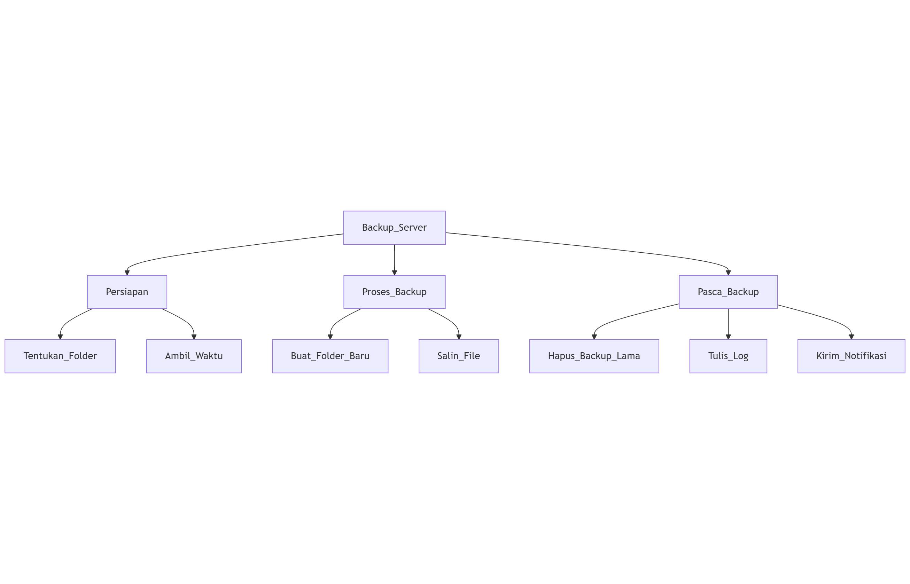

# Laporan Praktikum Minggu 4
Topik: proses user

---

## Identitas
- **Nama**  : Akhmad Raffi Sarmadan  
- **NIM**   : 250202974
- **Kelas** : 1IKRA

---

## Tujuan
1. Mahasiswa mampu menjelaskan konsep proses dan user dalam sistem operasi Linux.
2. Mahasiswa mampu menampilkan daftar proses yang sedang berjalan dan statusnya.
3. Mahasiswa mampu menggunakan perintah untuk membuat dan mengelola user.

---

## Dasar Teori
- Silberschatz et al., 2018 – Linux menggunakan UID dan GID untuk mengidentifikasi user dan grup; kontrol akses file dan proses bergantung pada kombinasi ini.
- Silberschatz et al., 2018 – Manajemen user dilakukan di user space, kernel memeriksa UID/GID saat autentikasi.
- Silberschatz et al., 2018 – Kernel menggunakan PCB (Process Control Block) untuk menyimpan status proses (PID, PPID, state, resource).
- Silberschatz et al., 2018 – Semua operasi dari user space menggunakan system call untuk meminta kernel melakukan operasi aman.

---

## Langkah Praktikum
1. Langkah-langkah yang dilakukan.  

jawab: -Eksperimen 1 – Identitas User Jalankan perintah berikut:
whoami
id
groups
Jelaskan setiap output dan fungsinya.
-Eksperimen 2 – Monitoring Proses
ps aux | head -10
top -n 1
Jelaskan kolom penting seperti PID, USER, %CPU, %MEM, COMMAND.
Simpan tangkapan layar top ke:
praktikum/week4-proses-user/screenshots/top.png
Buat user baru (jika memiliki izin sudo):
sudo adduser praktikan
sudo passwd praktikan
-Eksperimen 3 – Kontrol Proses
Jalankan program latar belakang:
sleep 1000 &
ps aux | grep sleep
Catat PID proses sleep.
Hentikan proses:
kill <PID>
Pastikan proses telah berhenti dengan ps aux | grep sleep.
-Eksperimen 4 – Analisis Hierarki Proses Jalankan:
pstree -p | head -20
Amati hierarki proses dan identifikasi proses induk (init/systemd).
Catat hasilnya dalam laporan.

2. Perintah yang dijalankan.

jawab: whoami
id
groups
sudo adduser praktikan
sudo passwd praktikan
ps aux | head -10
top -n 1
sleep 1000 &
ps aux | grep sleep
kill <PID>
pstree -p | head -20
3. File dan kode yang dibuat.

   jawab: praktikum/week4-proses-user/, praktikum/week4-proses-user/screenshots/top.png.

4. Commit message yang digunakan.

jawab: git add .
git commit -m "Minggu 4 - Manajemen Proses & User"
git push origin main
---

## Kode / Perintah
Tuliskan potongan kode atau perintah utama:
```bash
whoami
id
groups
sudo adduser praktikan
sudo passwd praktikan
ps aux | head -10
top -n 1
sleep 1000 &
ps aux | grep sleep
kill <PID>
pstree -p | head -20
```

---

## Hasil Eksekusi


---

## Penjelasan Hasil Eksperimen 
- Eksperimen 1

| **Perintah**             | **Hasil Output**                                                                 |
|---------------------------|----------------------------------------------------------------------------------|
| `whoami`                 | akh_raffi07                                                                    |
| `id`                     | uid=1000(akh_raffi07)<br>gid=1000(akh_raffi07)<br>groups=1000(akh_raffi07),4(adm),27(sudo) |
| `groups`                 | akh_raffi07 adm sudo                                                             |
| `sudo adduser praktikan` | adding user                                                                     |                                                                |
| `whoami`                 | praktikan                                                                       |

- Eksperimen 2

| **Kolom**  | **Keterangan** |
|-------------|----------------|
| `PID`       | **Process ID**, nomor unik yang diberikan sistem operasi untuk setiap proses. |
| `USER`      | **Pengguna** yang menjalankan proses tersebut. |
| `%CPU`      | **Persentase penggunaan CPU** oleh proses. |
| `%MEM`      | **Persentase penggunaan memori (RAM)** oleh proses. |
| `COMMAND`   | **Perintah** atau nama program yang dieksekusi. |
• Perintah ps aux | head -10 menampilkan snapshot dari 10 proses teratas yang sedang berjalan. Sementara top -n 1 menampilkan daftar proses secara real-time.

- Eksperimen 3

  1. sleep 1000 &: Menjalankan perintah sleep selama 1000 detik di latar belakang (simbol &). Sistem memberikan output PID dari proses tersebut, yaitu 454.
2. ps aux | grep sleep: Mencari proses yang mengandung kata "sleep". Hasilnya menunjukkan proses sleep 1000 dengan PID 454 sedang berjalan.
3. kill 1234: Mengirimkan sinyal terminasi ke proses dengan PID 454, sehingga proses tersebut berhenti dibuktikan dengan keterangan Terminated.
4. Pengecekan ulang dengan ps aux | grep sleep menunjukkan bahwa proses sleep sudah tidak ada lagi, membuktikan bahwa perintah kill berhasil.

- Eksperimen 4

  Perintah pstree -p menampilkan proses yang berjalan dalam format pohon, lengkap dengan PID-nya. Dari output di atas, terlihat bahwa systemd dengan PID 1 adalah proses induk dari hampir semua proses lain di sistem. Ini menunjukkan perannya sebagai manajer sistem dan layanan utama di Linux modern.
## Analisis
- Jelaskan makna hasil percobaan.

  jawab:- Percobaan ini menekankan bahwa user management dan proses adalah komponen inti kernel Linux yang mempengaruhi keamanan, kontrol akses, dan manajemen resource.
Di Windows, konsepnya mirip, tapi struktur data, API, dan tools berbeda.

- Hubungkan hasil dengan teori (fungsi kernel, system call, arsitektur OS).

  jawab: -User management → terkait UID/GID, permission, system call (getuid, getgroups, setuid) → kontrol akses & keamanan.

-Penambahan user & password → interaksi user space → PAM → kernel → file system (/etc/passwd, /etc/shadow).

-Proses & manajemen resource → kernel mengelola PCB, signals, CPU/memory scheduling → system call seperti fork(), execve(), kill() digunakan.

-Semua perintah percobaan menunjukkan arsitektur OS: user space tools berinteraksi melalui system call untuk meminta kernel melakukan operasi aman dan terkontrol.
- Apa perbedaan hasil di lingkungan OS berbeda (Linux vs Windows)?

  jawab: -Konsep identitas user, kontrol akses, dan manajemen proses sama pada kedua OS, tapi struktur data, system call, dan tools berbeda. Linux lebih command-line dan kernel-centric, sedangkan Windows lebih GUI dan database-centric.

---

## Kesimpulan
-Linux memungkinkan manajemen pengguna dan grup untuk keamanan dan kontrol akses.
-Identitas user, grup, dan hak akses bisa dicek dengan whoami, id, dan groups.
-Proses di Linux dapat dipantau, dijalankan di background, dan dihentikan sesuai kebutuhan.
---

## Tugas
1. 

2. User management adalah fondasi keamanan Linux.
Tanpa pengelolaan akun dan grup yang tepat:
Kontrol akses tidak efektif
Audit menjadi tidak jelas
Risiko kebocoran data dan penyalahgunaan meningkat
Dengan user management yang baik, sistem Linux bisa:
Membatasi akses file dan proses sesuai peran
Memastikan aktivitas tercatat dan dapat diaudit
Menegakkan prinsip keamanan seperti least privilege dan accountability
## Quiz
1. Apa fungsi dari proses init atau systemd dalam sistem Linux?

   Jawaban:init adalah sistem init tradisional (SysV), sederhana tapi terbatas.
systemd modern, lebih cepat, parallel booting, logging terintegrasi, dan manajemen service lebih lengkap.

2. Apa perbedaan antara kill dan killall?  

    Jawaban:Jadi, kill fokus pada PID spesifik, sedangkan killall fokus pada nama proses.
   
3. Mengapa user root memiliki hak istimewa di sistem Linux?
  
   Jawaban:Root dibutuhkan agar sistem dapat dikelola dan dikontrol secara penuh, memastikan keamanan, stabilitas, dan manajemen sumber daya. Tanpa superuser, pengguna biasa tidak bisa mengubah konfigurasi penting atau file sistem.
---

## Refleksi Diri
Tuliskan secara singkat:
- Apa bagian yang paling menantang minggu ini?

  jawab: saat sudo adduser dan sudo passwd
- Bagaimana cara Anda mengatasinya?  

jawab: banyak belajar lagi agar tidak pelupa
---

**Credit:**  
_Template laporan praktikum Sistem Operasi (SO-202501) – Universitas Putra Bangsa_
