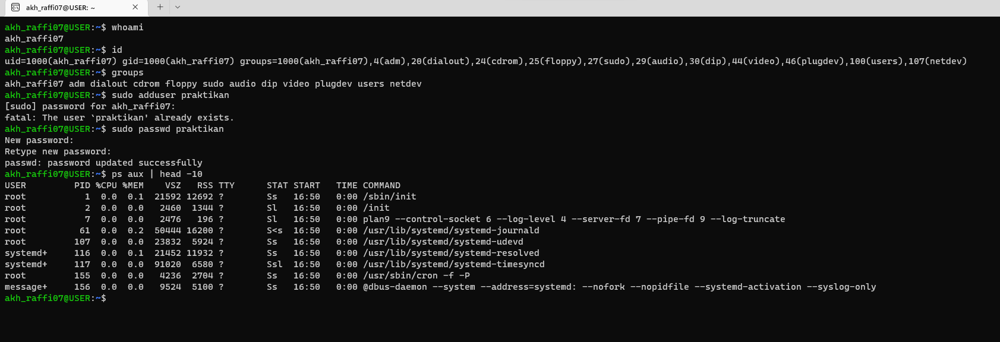
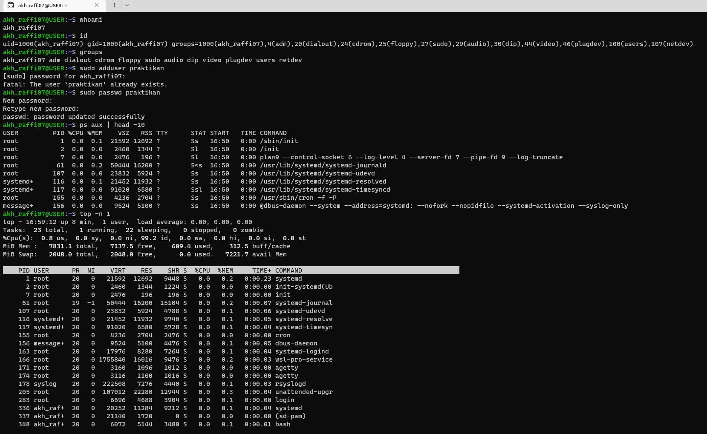
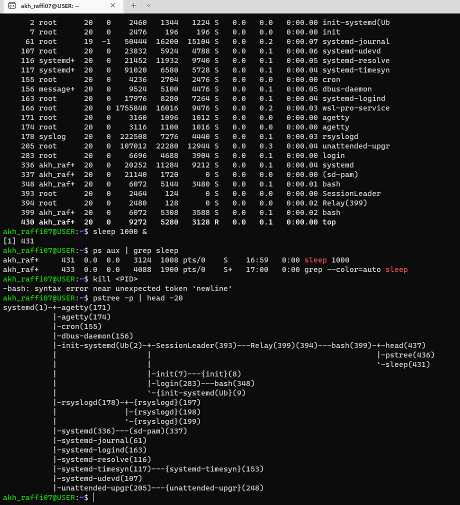

# Laporan Praktikum Minggu 4
Topik: proses user

---

## Identitas
- **Nama**  : Akhmad Raffi Sarmadan  
- **NIM**   : 250202974
- **Kelas** : 1IKRA

---

## Tujuan
Tuliskan tujuan praktikum minggu ini.  
Contoh:  
> Mahasiswa mampu menjelaskan fungsi utama sistem operasi dan peran kernel serta system call.

---

## Dasar Teori
Tuliskan ringkasan teori (3–5 poin) yang mendasari percobaan.

---

## Langkah Praktikum
1. Langkah-langkah yang dilakukan.  

jawab: -Eksperimen 1 – Identitas User Jalankan perintah berikut:
whoami
id
groups
Jelaskan setiap output dan fungsinya.
-Eksperimen 2 – Monitoring Proses
ps aux | head -10
top -n 1
Jelaskan kolom penting seperti PID, USER, %CPU, %MEM, COMMAND.
Simpan tangkapan layar top ke:
praktikum/week4-proses-user/screenshots/top.png
Buat user baru (jika memiliki izin sudo):
sudo adduser praktikan
sudo passwd praktikan
-Eksperimen 3 – Kontrol Proses
Jalankan program latar belakang:
sleep 1000 &
ps aux | grep sleep
Catat PID proses sleep.
Hentikan proses:
kill <PID>
Pastikan proses telah berhenti dengan ps aux | grep sleep.
-Eksperimen 4 – Analisis Hierarki Proses Jalankan:
pstree -p | head -20
Amati hierarki proses dan identifikasi proses induk (init/systemd).
Catat hasilnya dalam laporan.

2. Perintah yang dijalankan.

jawab: whoami
id
groups
sudo adduser praktikan
sudo passwd praktikan
ps aux | head -10
top -n 1
sleep 1000 &
ps aux | grep sleep
kill <PID>
pstree -p | head -20
3. File dan kode yang dibuat.

   jawab: praktikum/week4-proses-user/, praktikum/week4-proses-user/screenshots/top.png.

4. Commit message yang digunakan.

jawab: git add .
git commit -m "Minggu 4 - Manajemen Proses & User"
git push origin main
---

## Kode / Perintah
Tuliskan potongan kode atau perintah utama:
```bash
whoami
id
groups
sudo adduser praktikan
sudo passwd praktikan
ps aux | head -10
top -n 1
sleep 1000 &
ps aux | grep sleep
kill <PID>
pstree -p | head -20
```

---

## Hasil Eksekusi



---

## Analisis
- Jelaskan makna hasil percobaan.  
- Hubungkan hasil dengan teori (fungsi kernel, system call, arsitektur OS).  
- Apa perbedaan hasil di lingkungan OS berbeda (Linux vs Windows)?  

---

## Kesimpulan
Tuliskan 2–3 poin kesimpulan dari praktikum ini.

---

## Quiz
1. Apa fungsi dari proses init atau systemd dalam sistem Linux?

   Jawaban:init adalah sistem init tradisional (SysV), sederhana tapi terbatas.
systemd modern, lebih cepat, parallel booting, logging terintegrasi, dan manajemen service lebih lengkap.

2. Apa perbedaan antara kill dan killall?  

    Jawaban:Jadi, kill fokus pada PID spesifik, sedangkan killall fokus pada nama proses.
   
3. Mengapa user root memiliki hak istimewa di sistem Linux?
  
   Jawaban:Root dibutuhkan agar sistem dapat dikelola dan dikontrol secara penuh, memastikan keamanan, stabilitas, dan manajemen sumber daya. Tanpa superuser, pengguna biasa tidak bisa mengubah konfigurasi penting atau file sistem.
---

## Refleksi Diri
Tuliskan secara singkat:
- Apa bagian yang paling menantang minggu ini?

  jawab: saat sudo adduser dan sudo passwd
- Bagaimana cara Anda mengatasinya?  

jawab: banyak belajar lagi agar tidak pelupa
---

**Credit:**  
_Template laporan praktikum Sistem Operasi (SO-202501) – Universitas Putra Bangsa_
