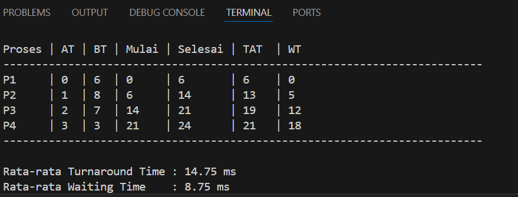

# Laporan Praktikum Minggu 9
Topik: sim-scheduling

---

## Identitas
- **Nama**  : Akhmad Raffi Sarmadan
- **NIM**   : 250202974 
- **Kelas** : 1IKRA

---

## Tujuan
1. Menghitung waktu mulai dan waktu selesai setiap proses pada algoritma FCFS.

2. Menyajikan hasil simulasi penjadwalan dalam bentuk tabel yang terstruktur.

3. Menentukan nilai rata-rata Waiting Time dan Turnaround Time sebagai indikator efisiensi penjadwalan.

4. Memahami karakteristik, kelebihan, dan kekurangan algoritma FCFS dalam pengelolaan proses CPU.
---

## Dasar Teori
1. Penjadwalan Proses pada Sistem Operasi

Penjadwalan proses merupakan mekanisme dalam sistem operasi yang bertugas mengatur urutan eksekusi proses di CPU. Tujuan utama dari penjadwalan adalah untuk meningkatkan efisiensi penggunaan CPU, meminimalkan waktu tunggu proses, serta memastikan keadilan bagi setiap proses yang masuk ke sistem. Sistem operasi menggunakan algoritma penjadwalan tertentu untuk menentukan proses mana yang akan dieksekusi terlebih dahulu berdasarkan kriteria tertentu, seperti waktu kedatangan atau prioritas.

2. Algoritma First Come First Served (FCFS)

Algoritma First Come First Served (FCFS) adalah algoritma penjadwalan CPU yang paling sederhana, di mana proses dieksekusi berdasarkan urutan kedatangannya ke dalam sistem. Proses yang datang lebih awal akan mendapatkan giliran eksekusi terlebih dahulu tanpa mempertimbangkan lama waktu eksekusi proses tersebut. Algoritma ini bersifat non-preemptive, artinya proses yang sedang berjalan tidak dapat dihentikan sampai selesai. Meskipun mudah diimplementasikan, FCFS memiliki kelemahan yaitu dapat menyebabkan convoy effect, di mana proses dengan burst time panjang menghambat proses lain yang lebih pendek.

3. Arrival Time, Burst Time, Waiting Time, dan Turnaround Time

Dalam penjadwalan proses, terdapat beberapa parameter penting yang digunakan untuk mengevaluasi kinerja algoritma. Arrival Time (AT) adalah waktu kedatangan suatu proses ke sistem, sedangkan Burst Time (BT) adalah lama waktu yang dibutuhkan proses untuk dieksekusi oleh CPU. Waiting Time (WT) merupakan waktu yang dihabiskan proses untuk menunggu sebelum dieksekusi, dan Turnaround Time (TAT) adalah total waktu yang dibutuhkan proses sejak datang hingga selesai dieksekusi. Nilai rata-rata WT dan TAT sering digunakan sebagai indikator efisiensi suatu algoritma penjadwalan.

---

## Langkah Praktikum
1.  Menyiapkan folder kerja `praktikum/week9-sim-scheduling/`.
2.  Membuat file `dataset.csv` yang berisi daftar proses (P1, P2, P3, P4) lengkap dengan *Arrival Time* dan *Burst Time*.
3.  Membuat program Python sederhana yang membaca file CSV, mengurutkan data berdasarkan waktu kedatangan, dan menghitung waktu tunggu secara berurutan.
4.  Menjalankan program di terminal dan membandingkan hasilnya dengan hitungan manual.
5.  Mendokumentasikan seluruh hasil simulasi, perhitungan, dan analisis dalam file laporan.md.

6. Melakukan commit dan push hasil praktikum ke repositori GitHub.
   ```bash
   git add .
   git commit -m "Minggu 9 - Simulasi Scheduling CPU"
   git push origin main
   ```
---

## Kode / Perintah
Tuliskan potongan kode atau perintah utama:
```bash
# Data proses
proses = ["P1", "P2", "P3", "P4"]
arrival_time = [0, 1, 2, 3]
burst_time = [6, 8, 7, 3]

mulai = []
selesai = []
tat = []
wt = []

waktu_sekarang = 0

# Perhitungan FCFS
for i in range(len(proses)):
    if waktu_sekarang < arrival_time[i]:
        waktu_sekarang = arrival_time[i]
    
    mulai.append(waktu_sekarang)
    waktu_sekarang += burst_time[i]
    selesai.append(waktu_sekarang)
    
    tat.append(selesai[i] - arrival_time[i])
    wt.append(tat[i] - burst_time[i])

# Cetak tabel
print("-" * 74)
print(f"{'Proses':<7}| {'AT':<3}| {'BT':<3}| {'Mulai':<6}| {'Selesai':<8}| {'TAT':<5}| {'WT':<3}")
print("-" * 74)

for i in range(len(proses)):
    print(f"{proses[i]:<7}| {arrival_time[i]:<3}| {burst_time[i]:<3}| "
          f"{mulai[i]:<6}| {selesai[i]:<8}| {tat[i]:<5}| {wt[i]:<3}")

print("-" * 74)

# Rata-rata
rata_tat = sum(tat) / len(tat)
rata_wt = sum(wt) / len(wt)

print(f"\nRata-rata Turnaround Time : {rata_tat:.2f} ms")
print(f"Rata-rata Waiting Time    : {rata_wt:.2f} ms")

```

---

## Hasil Eksekusi


---

## Analisis
Hasil percobaan menunjukkan bahwa algoritma First Come First Served (FCFS) mengeksekusi proses berdasarkan urutan kedatangan. Proses yang datang lebih awal akan dijalankan terlebih dahulu hingga selesai, sehingga proses dengan burst time besar dapat menyebabkan proses berikutnya memiliki waiting time dan turnaround time yang lebih lama. Hal ini sesuai dengan teori FCFS yang bersifat non-preemptive dan rentan terhadap convoy effect.

Dalam kaitannya dengan sistem operasi, penjadwalan proses merupakan tugas utama kernel dalam mengelola penggunaan CPU. Kernel menggunakan informasi proses yang diperoleh melalui system call untuk menentukan urutan eksekusi. Simulasi FCFS menggambarkan secara konseptual bagaimana kernel menjadwalkan proses secara berurutan dalam arsitektur sistem operasi.

Perbedaan lingkungan sistem operasi seperti Linux dan Windows tidak berpengaruh terhadap hasil simulasi secara logis karena seluruh proses perhitungan dilakukan oleh program. Namun, pada implementasi sistem operasi yang sebenarnya, Linux menerapkan Completely Fair Scheduler (CFS), sedangkan Windows menggunakan penjadwalan berbasis prioritas. Perbedaan kebijakan penjadwalan tersebut menyebabkan urutan eksekusi serta waktu tunggu proses dapat berbeda pada masing-masing sistem operasi.

---

## Kesimpulan
1. Algoritma First Come First Served (FCFS) menjalankan proses berdasarkan urutan kedatangan dan bersifat non-preemptive, sehingga proses dengan burst time besar dapat meningkatkan waiting time dan turnaround time proses lainnya.

2. Simulasi menggunakan Python membantu memahami konsep penjadwalan CPU serta peran kernel dalam mengatur eksekusi proses secara sistematis.

3. Meskipun hasil simulasi sama di berbagai sistem operasi, implementasi penjadwalan nyata pada Linux dan Windows berbeda karena menggunakan algoritma scheduler yang berbeda.

---

## Quiz
1. Mengapa simulasi diperlukan untuk menguji algoritma scheduling?

Simulasi diperlukan karena dapat menggambarkan cara kerja algoritma scheduling secara sistematis dan terkontrol tanpa harus menjalankannya langsung pada sistem operasi nyata. Dengan simulasi, proses perhitungan seperti waiting time dan turnaround time dapat dilakukan secara otomatis dan akurat, sehingga memudahkan analisis kinerja algoritma serta mengurangi kesalahan perhitungan.

2. Apa perbedaan hasil simulasi dengan perhitungan manual jika dataset besar?

Pada dataset kecil, hasil simulasi dan perhitungan manual umumnya sama. Namun, pada dataset besar, perhitungan manual lebih rentan terhadap kesalahan dan membutuhkan waktu lebih lama. Simulasi mampu memproses data dalam jumlah besar dengan cepat dan konsisten, sehingga hasil yang diperoleh lebih efisien dan reliabel.

3. Algoritma mana yang lebih mudah diimplementasikan? Jelaskan.

Algoritma First Come First Served (FCFS) merupakan algoritma yang paling mudah diimplementasikan karena hanya memerlukan pengurutan proses berdasarkan waktu kedatangan tanpa perhitungan prioritas atau preemption. Struktur algoritmanya sederhana sehingga cocok digunakan untuk pembelajaran dasar konsep penjadwalan CPU.
---

## Refleksi Diri
Tuliskan secara singkat:
- Apa bagian yang paling menantang minggu ini?
  menganaisan dan menentukan kode yang sesuai agar hasil eksekusi bisa berhasil
- Bagaimana cara Anda mengatasinya?
  tanya teman dan mencari referensi di media sosial

---

**Credit:**  
_Template laporan praktikum Sistem Operasi (SO-202501) – Universitas Putra Bangsa_
